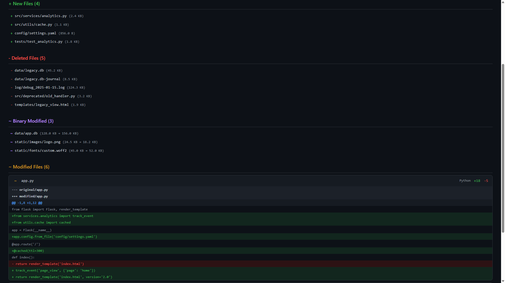

# diff_dirs

Recursive project folder comparison for projects without Git.
Compares two versions of a project and shows all differences –
new, deleted, and modified files with line-by-line diff.

<p align="center">
  
</p>

<p align="center">
  <em>Download and open <a href="example-report.html">example-report.html</a> in your browser to see a live demo.</em>
</p>

---

## What For?

When you're working on a project (React, Next.js, Java, …) and **don't have Git** available,
you have to manually track changes between the original and modified version.
This tool automates that: it scans both folders recursively, compares each file
by hash, and shows you exactly what changed where – in the terminal and optionally as an HTML report.

---

## Requirements

- **Python 3.8+**
- **PyYAML** – install once:

```bash
pip install pyyaml
```

---

## Quick Start

```bash
# 1. Generate example config
python diff_dirs.py --init

# 2. Adjust config (set paths)
#    → open diff_dirs.yaml and enter original / modified paths

# 3. Run
python diff_dirs.py
```

That's it. The script automatically looks for `diff_dirs.yaml` in the current directory.

---

## Configuration

All settings are in a single YAML file. Use `--init` to generate a
commented template:

```yaml
# Required fields – paths relative to config file or absolute
original: ./project-v1
modified: ./project-v2

# Output
output:
  html: true                    # Generate HTML report
  html_path: ./diff-report.html # Path to report
  color: true                   # Colored terminal output
  show_content: true            # Show content diffs (false = file list only)
  context_lines: 3              # Context lines around each change

# Filter
filter:
  ignore_dirs:                  # Completely ignore directories
    - node_modules
    - .next
    - dist
    - build
    - .git
    - __pycache__
    - .cache
    - target
    - .idea
    - .vscode

  ignore_files:                 # Ignore file patterns (glob syntax)
    - ".DS_Store"
    - "Thumbs.db"
    - "*.pyc"

  # Only compare specific file types (commented out = all)
  # extensions:
  #   - .ts
  #   - .tsx
  #   - .js
  #   - .java
  #   - .css
```

### Config Reference

| Field | Type | Default | Description |
|---|---|---|---|
| `original` | string | *Required* | Path to original folder |
| `modified` | string | *Required* | Path to modified folder |
| `output.html` | bool | `false` | Generate HTML report |
| `output.html_path` | string | `./diff-report.html` | Report save location |
| `output.color` | bool | `true` | ANSI colors in terminal |
| `output.show_content` | bool | `true` | Show line-by-line diffs |
| `output.context_lines` | int | `3` | Context lines per change |
| `filter.ignore_dirs` | list | *see above* | Directory names to skip |
| `filter.ignore_files` | list | `[]` | Glob patterns for files |
| `filter.extensions` | list | *all* | Whitelist for file extensions |

### Paths

All paths in the config are resolved **relative to the config file**.
Absolute paths work as well.

```yaml
# Config is located at /home/user/configs/diff_dirs.yaml
original: ../projects/app-v1       # → /home/user/projects/app-v1
modified: /opt/builds/app-v2       # → /opt/builds/app-v2 (absolute)
```

---

## Usage

```bash
# Default – looks for diff_dirs.yaml in current folder
python diff_dirs.py

# Specify custom config
python diff_dirs.py my-comparison.yaml

# Generate new example config
python diff_dirs.py --init
```

### Multiple Comparisons

You can create multiple config files for different comparisons:

```bash
python diff_dirs.py frontend.yaml    # compare frontend only
python diff_dirs.py backend.yaml     # compare backend only
python diff_dirs.py everything.yaml  # entire project
```

---

## Output

### Terminal

The script shows a colored summary with:

- Overview (file count, changes, lines +/-)
- Breakdown by file type (TypeScript, Java, CSS, …)
- List of new, deleted, and binary-changed files
- Line-by-line diffs for modified text files

```
══════════════════════════════════════════════════════════════════════
  DIRECTORY DIFF REPORT
══════════════════════════════════════════════════════════════════════
  Original:  /home/user/project-v1
  Modified:  /home/user/project-v2

  OVERVIEW
  Files in Original:       142
  Files in Modified:       148
  Unchanged:               130
  + New Files:               8
  - Deleted Files:           2
  ~ Modified Files:         10
  ~ Binary Modified:         3
  Lines Added:            +234
  Lines Removed:           -87

  BY FILE TYPE
    React TSX            +3 ~5
    TypeScript           +2 ~2
    CSS                  ~3
    Log                  ~2
    Python               -2
```

### HTML Report

With `output.html: true` an interactive HTML report is generated:

- Dark theme in GitHub style
- Statistic cards with overview
- Search field to filter by filename
- Collapsible diffs per file
- Syntax highlighting for additions/deletions

Just open in browser – no additional dependencies.

---

## Typical Setups

### Next.js / React Project

```yaml
original: ./app-original
modified: ./app-modified

output:
  html: true
  html_path: ./report.html

filter:
  ignore_dirs:
    - node_modules
    - .next
    - dist
    - build
    - .git
  ignore_files:
    - "package-lock.json"
    - "yarn.lock"
```

### Java / Spring Project

```yaml
original: ./backend-v1
modified: ./backend-v2

output:
  html: true
  context_lines: 5

filter:
  ignore_dirs:
    - target
    - build
    - .gradle
    - .idea
    - bin
  ignore_files:
    - "*.class"
    - "*.jar"
  extensions:
    - .java
    - .xml
    - .properties
    - .yaml
```

### Check Frontend Code Only

```yaml
original: ./v1
modified: ./v2

output:
  html: false
  show_content: true
  context_lines: 5

filter:
  ignore_dirs:
    - node_modules
    - .next
  extensions:
    - .ts
    - .tsx
    - .js
    - .jsx
    - .css
    - .scss
```

### Quick Overview Without Diffs

```yaml
original: ./v1
modified: ./v2

output:
  show_content: false    # file list only, no content
  html: false
```

---

## Recognized File Types

The tool recognizes and groups the following file types in statistics:

TypeScript, React TSX, JavaScript, React JSX, Java, Python, CSS, SCSS,
HTML, JSON, YAML, XML, Markdown, SQL, Shell, Environment, Properties,
Gradle, TOML, Config, Log, Text, INI, Batch, PowerShell.

Other file types are displayed by their extension.

Binary files (images, fonts, archives, databases, etc.) are compared by hash
and reported as "binary changed" – without content diff.

---

## Project Structure

```
diff_dirs.py          # The script
diff_dirs.yaml        # Your configuration (generated with --init)
diff-report.html      # HTML report (generated when html: true)
example-report.html   # Example HTML report for reference
screenshot.png        # Screenshot for README
README.md             # This file
```
